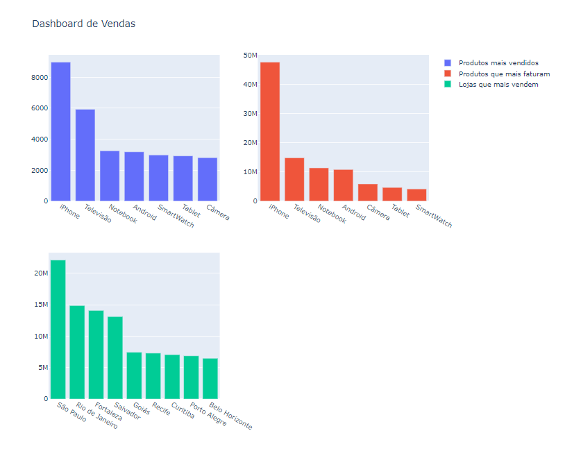
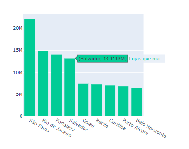
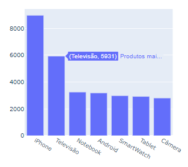
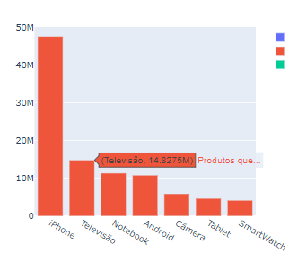

# Dashboard de Vendas
- O projeto consiste em analisar dados de vendas de várias cidades no Brasil, com objetivo de identificar quais produtos foram mais vendidos (em quantidade e faturamento) e lojas mais venderam (em faturamento). Posteriormente o projeto será aperfeiçoado, adicionando novos gráficos e sugestões de decisão de negócio baseado nos resultados. Este repositório também conta com assinaturas em cada commit (selo de verificação).
# Processos envolvidos no projeto
- Importação de base de dados
- Tratamento e compilação das bases de dados
- Cálculo do produto mais vendido (em quantidade)
- Cálculo do produto que mais faturou (em faturamento)
- Cálculo da loja/cidade que mais vendeu (em faturamento)
- Criação de um Dashboard avançado e interativo
# Bibliotecas utilizadas
- os
- pandas
- plotly.express
- plotly.subplots
- plotly.graph_objects
# Dashboard de Vendas
- Este projeto também inclui a criação de um dashboard interativo usando a biblioteca Plotly, onde o usuário pode interagir com os gráficos para ver informações mais detalhadas.
# Progresso visual:
## Visão geral

## Gráficos individuais

