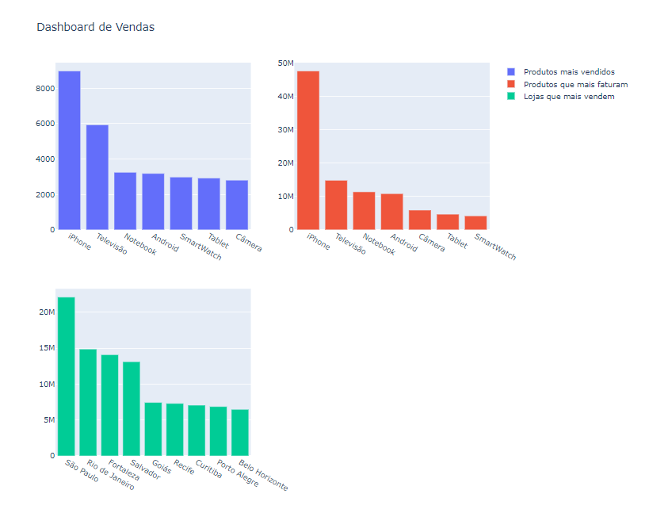

# Projeto feito para aplicar conhecimentos adquiridos sobre Python na faculdade.
## Dashboard de Vendas e Devoluções
- O projeto consiste em analisar dados de vendas e devoluções de várias cidades no Brasil, com objetivo de identificar qual produto gerou maior faturamento, qual produto teve mais devoluções e qual foi o valor de faturamento de cada item. Posteriormente o projeto será aperfeiçoado, adicionando novos gráficos e sugestões de decisão de negócio baseado nos resultados. Este repositório também conta com chaves de acesso e assinatura, contendo selo de verificado em cada commit.
# Processos envolvidos no projeto
- Importação de base de dados
- Tratamento e compilação das bases de dados
- Cálculo do produto mais vendido (em quantidade)
- Cálculo do produto que mais faturou (em faturamento)
- Cálculo da loja/cidade que mais vendeu (em faturamento)
# Bibliotecas utilizadas
- os
- pandas
- plotly.express
- plotly.subplots
- plotly.graph_objects
# Dashboard de Vendas
- Este projeto também inclui a criação de um dashboard interativo usando a biblioteca Plotly. O dashboard exibe gráficos de barras que mostram os produtos mais vendidos, os produtos que mais faturam e as lojas/cidades que mais vendem. O usuário pode interagir com os gráficos para ver informações mais detalhadas.
# Anotações e atualizações do progresso:
- Primeiro fiz a importação, tratamento e compilação da base de dados. Fiz também alguns calculos de faturamento.
- Fiz alguns subplots e adicionei os gráficos aos subplots.
- Como o tempo está apertado e preciso voltar a estudar, pretendo continuar posteriormente e adicionar mais informações e gráficos.
# Progresso visual:
## Visão geral

## Gráficos individuais

#### Produtos Mais Vendidos

#### Lojas Que Mais Vendem

#### Produtos Que Mais Faturaram
